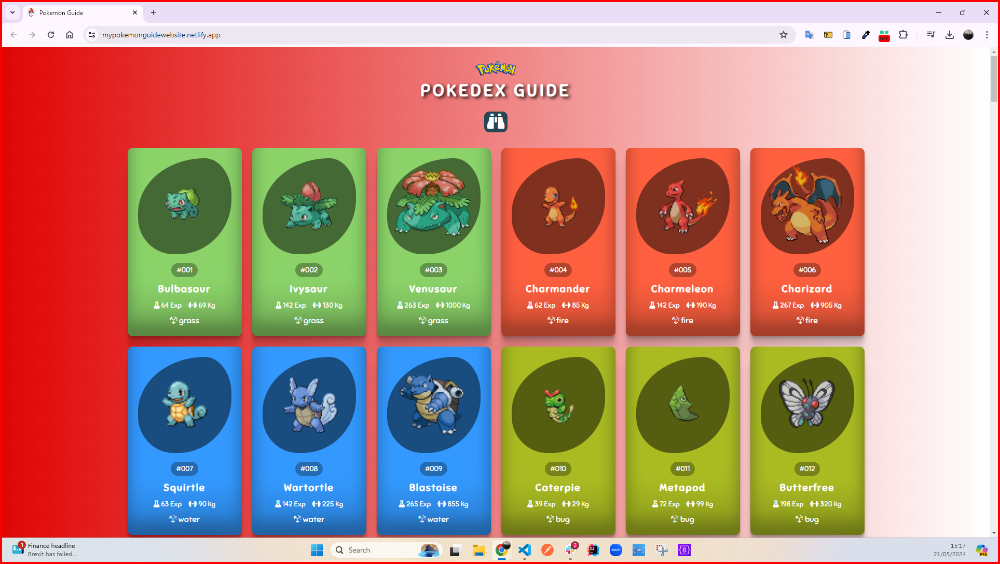
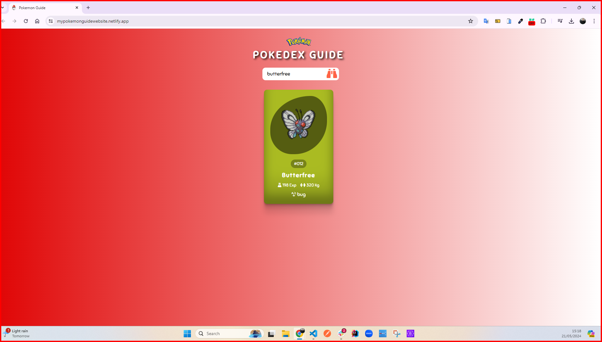

<h1>Pokemon Guide Project</h1>

An interactive Pokédex website for Pokémon fans that I created with HTML5, CSS, JavaScript, and API.
Users can easily search for the Pokédex they want and view comprehensive information for each Pokédex, including name, experience points, weight in kilograms, and more. My project runs responsively on every device screen.

<h2> The following technologies were used in the frontend development phase of my site: </h2>

- HTML5
- CSS3
- JavaScript
- API

<h2> Visit My Pokemon Guide Project: </h2>

- https://mypokemonguidewebsite.netlify.app/

<h4>GIF</h4>

<h4>IMAGES</h4>

